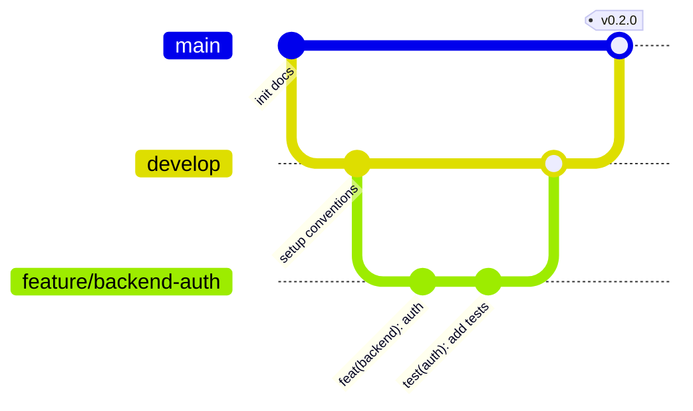

# 🤝 CONTRIBUTING — Quy ước phát triển Memoir

Tài liệu này quy định **mô hình nhánh**, **quy ước commit**, và **quy trình Pull Request** để làm việc chuyên nghiệp.

---

## 1. Mô hình nhánh (Branching model)

Memoir dùng **GitHub Flow mở rộng** (có nhánh tích hợp `develop`).



| Nhánh | Vai trò | Nhánh nguồn | Hợp nhất vào |
|---|---|---|---|
| `main` | **Production** — luôn chạy được, có tag phiên bản | — | — |
| `develop` | **Integration** — gom tính năng trước khi release | `main` | `main` (khi release) |
| `feature/<scope>` | Phát triển tính năng | `develop` | `develop` |
| `fix/<scope>` | Sửa lỗi (không khẩn cấp) | `develop` | `develop` |
| `docs/<scope>` | Tài liệu | `develop` | `develop` |
| `chore/<scope>` | Việc lặt vặt (config, CI, deps) | `develop` | `develop` |
| `refactor/<scope>` | Tái cấu trúc | `develop` | `develop` |
| `release/<x.y.z>` | Chuẩn bị phát hành | `develop` | `main` + `develop` |
| `hotfix/<x.y.z>` | Sửa lỗi khẩn cấp trên production | `main` | `main` + `develop` |

> **Nguyên tắc vàng**: `main` **không bao giờ** commit trực tiếp. Mọi thay đổi đi qua nhánh riêng → PR → review → merge.

---

## 2. Quy tắc đặt tên nhánh

`<type>/<scope>` — chữ thường, nối bằng `-`, ngắn gọn, dùng dấu `/` phân cấp.

Ví dụ hợp lệ:
```
feature/backend-entries-api
feature/flutter-entry-editor
fix/stats-month-grid-timezone
docs/update-api-reference
chore/ci-github-actions
```

---

## 3. Quy ước commit (Conventional Commits)

Định dạng:
```
<type>(<scope>): <mô tả ngắn, thì hiện tại, không viết hoa đầu>

[body tùy chọn: vì sao, ảnh hưởng gì]

[footer: BREAKING CHANGE / Closes #123]
```

**Các `type` được dùng:**

| type | Ý nghĩa |
|---|---|
| `feat` | Tính năng mới |
| `fix` | Sửa lỗi |
| `docs` | Tài liệu |
| `style` | Format (không đổi logic) |
| `refactor` | Tái cấu trúc |
| `perf` | Tối ưu hiệu năng |
| `test` | Thêm/sửa test |
| `chore` | Build, CI, deps, config |
| `ci` | Cấu hình CI/CD |

**`scope` gợi ý**: `backend`, `flutter`, `db`, `auth`, `images`, `quotes`, `stats`, `docs`, `ci`.

Ví dụ:
```
feat(backend): add JWT auth endpoints
fix(flutter): correct mood color on month grid
docs(api): document /random-pair response
chore(deps): bump fastapi to 0.115
```

---

## 4. Quy trình Pull Request

1. Cập nhật nhánh nền: `git checkout develop && git pull`
2. Tạo nhánh: `git checkout -b feature/<scope>`
3. Code + commit theo Conventional Commits.
4. Đẩy nhánh: `git push -u origin feature/<scope>`
5. Mở PR vào `develop` (dùng template sẵn có).
6. Review & vượt CI → **Squash and merge**.
7. Xóa nhánh sau khi merge.

---

## 5. Phiên bản & Tag (Semantic Versioning)

- Định dạng: `vMAJOR.MINOR.PATCH` (vd `v0.1.0`).
- Đang phát triển: `0.x.y`.
- Tạo tag khi merge `release/*` vào `main`:
```powershell
git tag -a v0.1.0 -m "Phase 0: docs & design"
git push origin v0.1.0
```

---

## 6. Checklist trước khi mở PR

- [ ] Code build/chạy được cục bộ
- [ ] Không commit `.env`, secret, thư mục build
- [ ] Cập nhật tài liệu/`docs/` nếu thay đổi API/schema
- [ ] Commit message đúng Conventional Commits
- [ ] Nhánh đặt tên đúng quy ước
