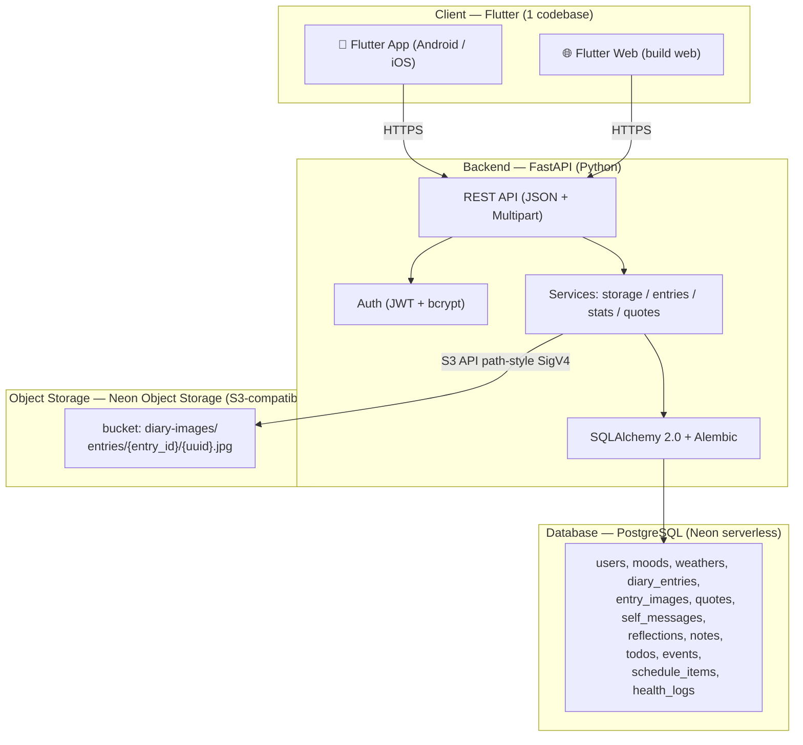
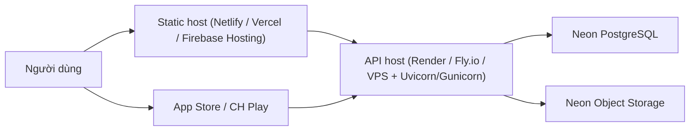

# 01 — Kiến trúc hệ thống

## 1. Tổng quan

Memoir được thiết kế theo mô hình **client–server 3 tầng**:

1. **Presentation (Flutter)**: một codebase duy nhất build ra **mobile app** và **web app**.
2. **Application (FastAPI)**: xử lý nghiệp vụ, xác thực, upload ảnh, truy vấn thống kê.
3. **Data (Neon)**: **PostgreSQL** lưu dữ liệu có cấu trúc & metadata ảnh; **Neon Object Storage** lưu file ảnh.

## 2. Sơ đồ kiến trúc



## 3. Thành phần chi tiết

### 3.1. Flutter (App + Web)
- **Mục đích**: giao diện người dùng, gọi API, lưu token an toàn.
- **Đặc điểm**: Material 3; responsive cho cả màn hình điện thoại và trình duyệt.
- **Thư viện chính**: `flutter_riverpod` (state), `go_router` (điều hướng), `dio` (HTTP + upload), `image_picker`/`file_picker`, `flutter_secure_storage` (JWT), `table_calendar`, `fl_chart`.
- **Build**:
  - Web: `flutter build web --release` → thư mục `build/web` (tĩnh, deploy CDN).
  - App: `flutter build apk --release` / `flutter build appbundle` / `flutter build ios`.

### 3.2. FastAPI (Backend)
- **Mục đích**: API REST duy nhất cho cả app và web.
- **Cấu trúc logic**:
  - `routers/` — định nghĩa endpoint theo domain (auth, entries, images, quotes, notes, todos, events, schedules, health, stats).
  - `services/` — nghiệp vụ (storage upload/download, chọn cặp câu ngẫu nhiên, tổng hợp lưới tháng).
  - `models/` — ORM SQLAlchemy.
  - `schemas/` — Pydantic request/response.
  - `core/` — config (.env), database session, security (JWT/bcrypt), storage client (boto3).
- **Chạy**: `uvicorn app.main:app`. Swagger UI tại `/docs`.

### 3.3. Neon Object Storage (ảnh)
- **Giao thức**: S3-compatible, **chỉ path-style** + **SigV4**.
- **Cấu hình client**: boto3 với `endpoint_url`; `AWS_ACCESS_KEY_ID = token_id`, `AWS_SECRET_ACCESS_KEY = s3_secret_access_key`.
- **Bucket**: `diary-images` (private mặc định), prefix `entries/{entry_id}/`.
- **Truy cập ảnh**: dùng **presigned GET URL** (hạn ngắn) khi hiển thị.
- **Hạn chế đã biết**: không hỗ trợ `PutBucketAcl`/`PutBucketPolicy` (đặt `access level` qua Console/API Neon); không hỗ trợ notifications/versioning thực thi.

### 3.4. PostgreSQL (Neon serverless)
- Lưu toàn bộ dữ liệu có cấu trúc + metadata ảnh (object_key, url, size, content_type...).
- **Migrations**: Alembic quản lý schema.
- **Cách ly dữ liệu**: mọi bảng nghiệp vụ có `user_id` → chỉ trả về dữ liệu của user đang đăng nhập.

## 4. Bảo mật

| Hạng mục | Giải pháp |
|---|---|
| Xác thực | JWT HS256, `Authorization: Bearer <token>` |
| Mật khẩu | Hash bcrypt (passlib) |
| Lưu token (client) | `flutter_secure_storage` |
| Cách ly dữ liệu | Lọc theo `user_id` từ token ở mọi truy vấn |
| Ảnh | Bucket private + presigned URL |
| Bí mật | Đặt trong `.env`, không commit (`.gitignore`) |
| CORS | Bật `CORSMiddleware` cho domain web |

## 5. Triển khai (deployment) — dự kiến



- Backend: chạy Uvicorn (dev) → Gunicorn+Uvicorn worker (prod).
- Web: build tĩnh → host CDN.
- App: phát hành qua store hoặc phân phối nội bộ (APK).

## 6. Sơ đồ thư mục backend (dự kiến)

```
backend/
├─ app/
│  ├─ main.py
│  ├─ core/       (config.py, database.py, security.py, storage.py, deps.py)
│  ├─ models/     (user.py, entry.py, image.py, quote.py, note.py, todo.py, event.py, schedule.py, health.py, lookup.py)
│  ├─ schemas/    (auth.py, entry.py, quote.py, ...)
│  ├─ routers/    (auth.py, entries.py, images.py, quotes.py, moods.py, weathers.py, reflections.py, notes.py, todos.py, events.py, schedules.py, health.py, stats.py)
│  ├─ services/   (storage_service.py, quote_service.py, stats_service.py)
│  └─ seed/       (quotes_100.json, seed.py)
├─ alembic/
├─ requirements.txt
└─ .env.example
```
