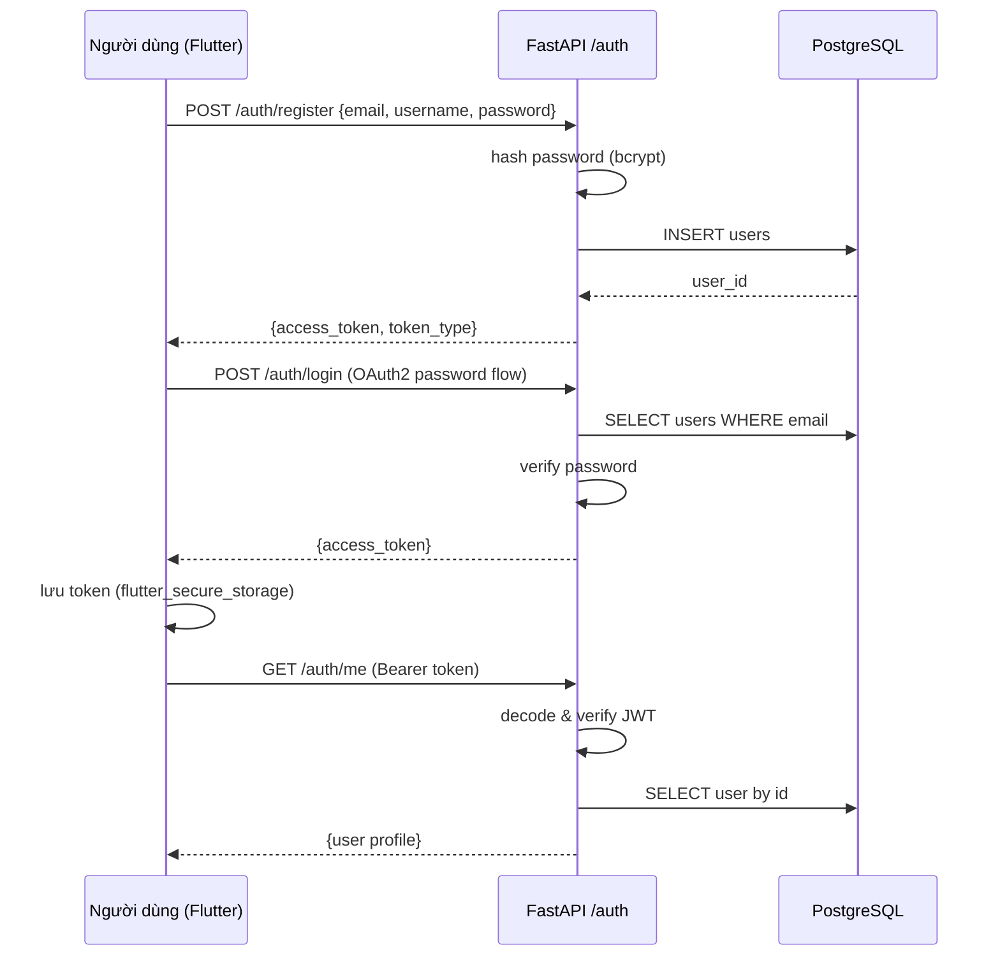
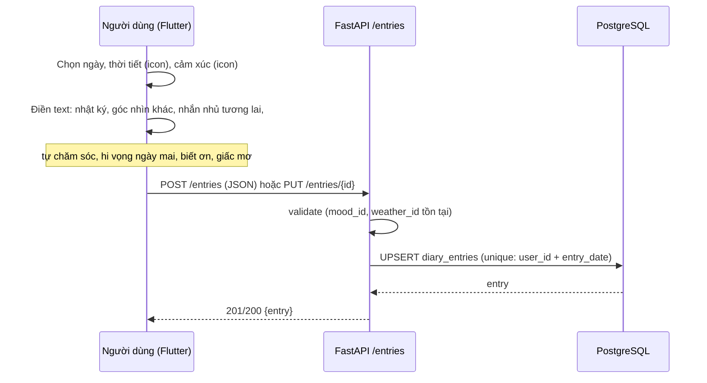
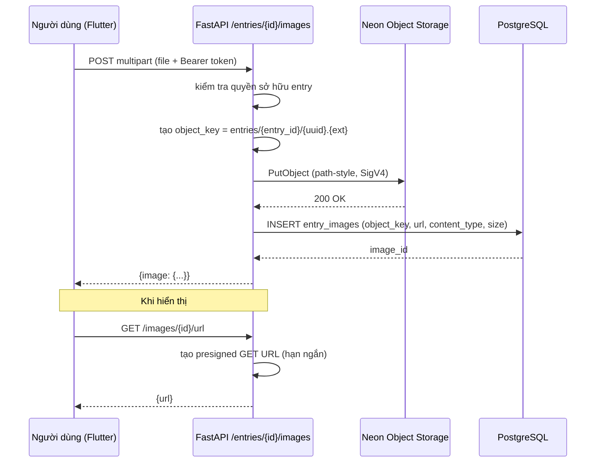
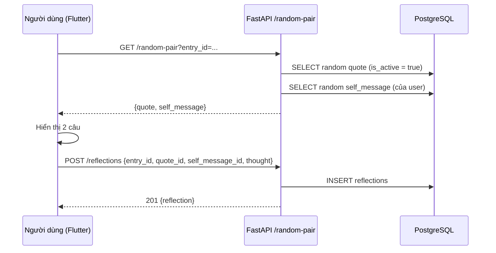
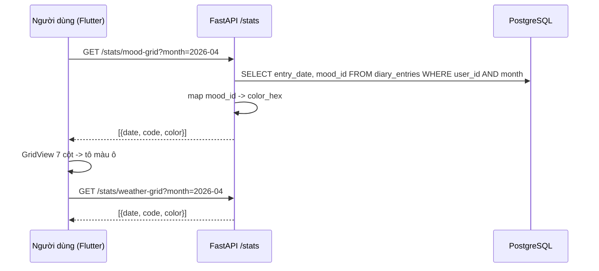
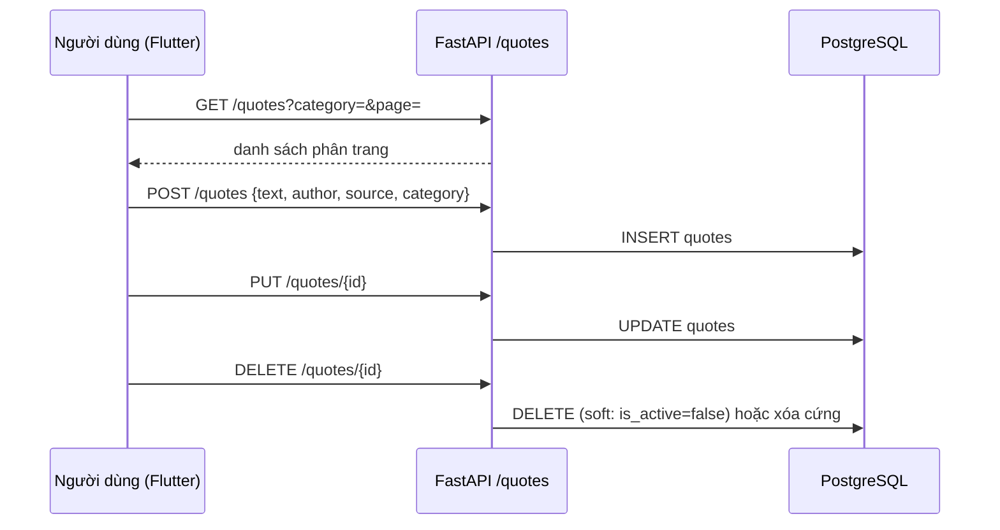
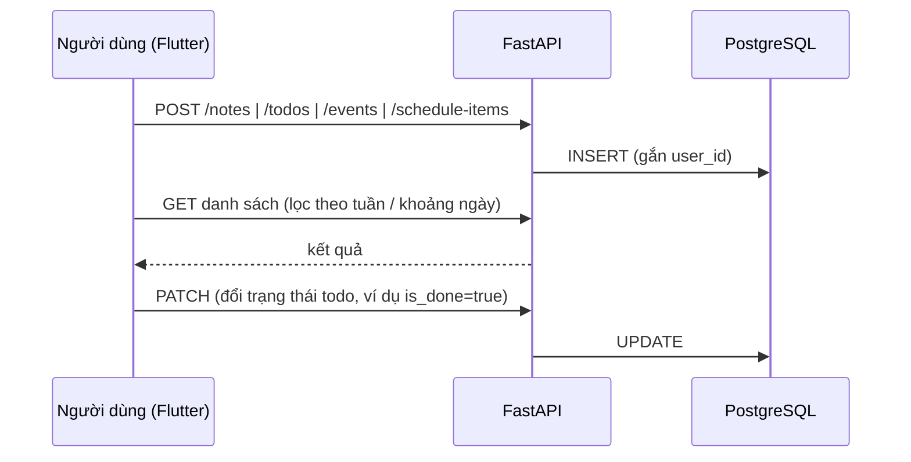
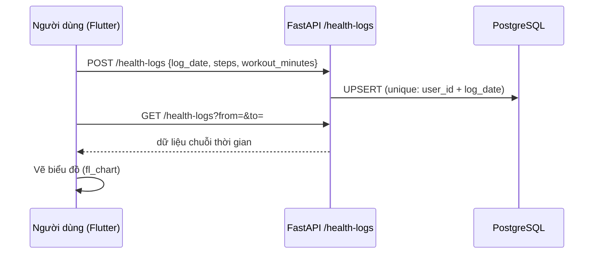

# 02 — Luồng hoạt động (Data Flow)

Tài liệu mô tả các luồng nghiệp vụ chính của Memoir.

---

## 1. Luồng xác thực (Đăng ký / Đăng nhập)

**Ghi chú**
- Mọi request tài nguyên phải kèm `Authorization: Bearer <token>`.
- Token hết hạn → client chuyển về màn Login.
- Dữ liệu luôn lọc theo `user_id` lấy từ token.

---

## 2. Luồng viết & lưu nhật ký

**Quy tắc**
- Mỗi user chỉ có **1 entry / ngày** (`unique(user_id, entry_date)`).
- Lưu lần đầu = `POST`; sửa = `PUT /entries/{id}` (upsert theo ngày).

---

## 3. Luồng upload ảnh (Flutter → FastAPI → Neon Object Storage → PostgreSQL)

**Ghi chú**
- Ảnh không đi qua DB; DB chỉ lưu **metadata** (khóa đối tượng).
- Xóa ảnh: `DELETE /images/{id}` → xóa object trên storage + xóa record DB.

---

## 4. Luồng sinh "cặp câu" ngẫu nhiên + phản tư

Yêu cầu: mỗi ngày hiển thị **1 câu từ kho câu thu thập trên mạng** + **1 câu từ lời nhắn nhủ của bản thân**, sau đó người dùng viết **suy nghĩ về 2 câu đó**.

**Quy tắc chọn**
- Câu kho: ưu tiên chưa xuất hiện gần đây trong `reflections` của user (tránh lặp).
- Lời nhắn nhủ bản thân: lấy ngẫu nhiên từ `self_messages` của user; nếu trống thì tạo gợi ý từ `future_message` của các entry cũ.

---

## 5. Luồng dựng lưới tháng (mood grid & weather grid)

**Hiển thị**: 2 bảng riêng (Mood / Weather), dạng lịch tháng 7 cột × ~6 hàng; mỗi ô là một ngày, **đổ màu theo `color_hex`** của mood/weather của ngày đó; ngày không có entry để trống/xám nhạt.

---

## 6. Luồng CRUD kho câu

**Ghi chú**
- Kho câu có thể **CRUD** đầy đủ.
- Seed sẵn **100 câu** (xem [08-quotes-seed.md](08-quotes-seed.md)).
- `is_active=false` = ẩn khỏi vòng random nhưng vẫn giữ dữ liệu.

---

## 7. Luồng ghi chú / todo / sự kiện / lịch biểu

- **Mục tiêu tuần**: `todos` lọc theo `week_label` / `due_date`.
- **Sự kiện đặc biệt**: `events` (start_at, end_at, location).
- **Lịch biểu**: `schedule_items` (hỗ trợ lặp qua `recurrence_rule` — RFC5545 rút gọn).

---

## 8. Luồng theo dõi sức khỏe

- Mỗi ngày 1 bản ghi sức khỏe (`unique(user_id, log_date)`).
- Nguồn số bước chân: nhập tay, hoặc tích hợp HealthKit/Google Fit ở Phase sau (ngoài phạm vi hiện tại).

