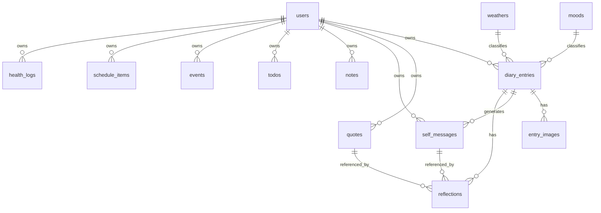

# 03 — Thiết kế Database (PostgreSQL)

## 1. Quy ước chung

- Engine: PostgreSQL (Neon serverless).
- Kiểu dữ liệu: `uuid` cho khóa chính (hoặc `bigserial`), `timestamptz` cho thời gian, `date` cho ngày.
- **Mọi bảng nghiệp vụ có `user_id`** → cách ly dữ liệu theo tài khoản.
- Ràng buộc duy nhất quan trọng: `diary_entries(user_id, entry_date)`, `health_logs(user_id, log_date)`.
- Xóa mềm với `is_active`/`deleted_at` cho các bảng cần giữ dữ liệu (quotes, entries).

## 2. ERD (Mermaid)

## 3. Bảng `users`

| Cột | Kiểu | Ràng buộc | Mô tả |
|---|---|---|---|
| id | uuid | PK, default gen_random_uuid() | Định danh user |
| email | varchar(255) | UNIQUE, NOT NULL | Email đăng nhập |
| username | varchar(50) | UNIQUE, NOT NULL | Tên hiển thị/đăng nhập |
| password_hash | varchar(255) | NOT NULL | Hash bcrypt |
| display_name | varchar(100) | NULL | Tên hiển thị |
| is_active | boolean | NOT NULL default true | Kích hoạt tài khoản |
| role | varchar(20) | NOT NULL default 'user', indexed | `user` hoặc `admin`; admin được sửa kho câu (câu `user_id IS NULL`) và quản lý tài khoản |
| created_at | timestamptz | NOT NULL default now() | |
| updated_at | timestamptz | NOT NULL default now() | |

## 4. Bảng tra cứu `moods`

| Cột | Kiểu | Ràng buộc | Mô tả |
|---|---|---|---|
| id | smallint | PK | |
| code | varchar(20) | UNIQUE, NOT NULL | vd: happy |
| label_vi | varchar(50) | NOT NULL | vd: Vui |
| color_hex | char(7) | NOT NULL | vd: #FFD93D |
| icon | varchar(20) | NOT NULL | emoji/icon name |
| sort_order | smallint | NOT NULL default 0 | |

**Seed 5 cảm xúc**

| code | label_vi | icon | color_hex |
|---|---|---|---|
| happy | Vui | 😀 | #FFD93D |
| sad | Buồn | 😢 | #4A90D9 |
| bored | Chán | 😑 | #9E9E9E |
| normal | Bình thường | 😐 | #A8D5BA |
| angry | Giận | 😠 | #E74C3C |

## 5. Bảng tra cứu `weathers`

| Cột | Kiểu | Ràng buộc | Mô tả |
|---|---|---|---|
| id | smallint | PK | |
| code | varchar(20) | UNIQUE, NOT NULL | vd: sunny |
| label_vi | varchar(50) | NOT NULL | vd: Nắng |
| color_hex | char(7) | NOT NULL | |
| icon | varchar(20) | NOT NULL | |
| sort_order | smallint | NOT NULL default 0 | |

**Seed 5 thời tiết**

| code | label_vi | icon | color_hex |
|---|---|---|---|
| sunny | Nắng | ☀️ | #FFB300 |
| overcast | Râm | ⛅ | #90A4AE |
| rain | Mưa | 🌧️ | #5C9EDB |
| storm | Bão | ⛈️ | #37474F |
| other | Khác | ❔ | #78909C |

## 6. Bảng `diary_entries` (trung tâm)

| Cột | Kiểu | Ràng buộc | Mô tả |
|---|---|---|---|
| id | uuid | PK | |
| user_id | uuid | FK→users(id), NOT NULL | Chủ sở hữu |
| entry_date | date | NOT NULL | Ngày của nhật ký |
| mood_id | smallint | FK→moods(id), NULL | Cảm xúc |
| weather_id | smallint | FK→weathers(id), NULL | Thời tiết |
| diary_text | text | NULL | Nội dung nhật ký |
| other_perspective | text | NULL | 1 câu quan điểm từ góc nhìn khác |
| future_message | text | NULL | 1 câu nhắn nhủ tương lai (hoặc câu hỏi) |
| self_care | text | NULL | Hôm nay tự chăm sóc bản thân thế nào |
| tomorrow_hope | text | NULL | Hi vọng cho ngày mai |
| gratitude | text | NULL | Lòng biết ơn |
| dream | text | NULL | Giấc mơ đã trải qua |
| created_at | timestamptz | NOT NULL default now() | |
| updated_at | timestamptz | NOT NULL default now() | |

**Ràng buộc**: `UNIQUE (user_id, entry_date)`.

## 7. Bảng `entry_images`

| Cột | Kiểu | Ràng buộc | Mô tả |
|---|---|---|---|
| id | uuid | PK | |
| entry_id | uuid | FK→diary_entries(id) ON DELETE CASCADE | Thuộc entry nào |
| object_key | varchar(512) | NOT NULL | Khóa trên Neon Object Storage, vd `entries/{entry_id}/{uuid}.jpg` |
| url | varchar(1024) | NULL | URL công khai/presigned (nếu có) |
| content_type | varchar(100) | NOT NULL | vd image/jpeg |
| size_bytes | bigint | NULL | Kích thước |
| width | int | NULL | Chiều rộng ảnh |
| height | int | NULL | Chiều cao ảnh |
| caption | varchar(255) | NULL | Chú thích ảnh |
| created_at | timestamptz | NOT NULL default now() | |

**Index**: `idx_entry_images_entry (entry_id)`.

## 8. Bảng `quotes` (kho câu — CRUD)

| Cột | Kiểu | Ràng buộc | Mô tả |
|---|---|---|---|
| id | uuid | PK | |
| user_id | uuid | FK→users(id), NULL | NULL = câu hệ thống/seed; có giá trị = câu user thêm |
| text | text | NOT NULL | Nội dung câu |
| author | varchar(150) | NULL | Tác giả |
| source | varchar(150) | NULL | Nguồn (Facebook, TikTok, sách...) |
| category | varchar(50) | NULL | động viên / giáo dục / ... |
| is_active | boolean | NOT NULL default true | Bật/tắt khỏi vòng random |
| created_at | timestamptz | NOT NULL default now() | |
| updated_at | timestamptz | NOT NULL default now() | |

**Index**: `idx_quotes_category (category)`, `idx_quotes_active (is_active)`.

## 9. Bảng `self_messages` (lời nhắn nhủ của bản thân)

| Cột | Kiểu | Ràng buộc | Mô tả |
|---|---|---|---|
| id | uuid | PK | |
| user_id | uuid | FK→users(id), NOT NULL | |
| entry_id | uuid | FK→diary_entries(id) ON DELETE SET NULL, NULL | Sinh ra từ entry nào (nếu có) |
| content | text | NOT NULL | Nội dung lời nhắn |
| created_at | timestamptz | NOT NULL default now() | |

## 10. Bảng `daily_quotes` (cặp câu đã hiển thị theo ngày)

Mỗi ngày chỉ lưu **một** cặp câu, nhờ ràng buộc `uq_daily_quotes_user_date (user_id, quote_date)`.

| Cột | Kiểu | Ràng buộc | Mô tả |
|---|---|---|---|
| id | uuid | PK | |
| user_id | uuid | FK→users(id) ON DELETE CASCADE, NOT NULL | |
| quote_date | date | NOT NULL, index | Ngày hiển thị |
| quote_id | uuid | FK→quotes(id) ON DELETE SET NULL, NULL | Câu kho thứ nhất |
| quote_id_2 | uuid | FK→quotes(id) ON DELETE SET NULL, NULL | Câu kho thứ hai — chỉ có khi ngày đó rút **2 câu** (xem bên dưới) |
| self_message_id | uuid | FK→self_messages(id) ON DELETE SET NULL, NULL | Lời nhắn đã ghép |
| created_at | timestamptz | NOT NULL default now() | |

`ON DELETE SET NULL` giữ lại dòng khi câu bị xoá khỏi kho, nên lịch sử không bị mất ngày.

**Quy tắc ghép cặp** (`quote_service.MIN_SELF_MESSAGES_TO_PAIR = 10`):

| Số lời nhắn đã lưu | Ngày đó hiển thị | Lưu vào DB |
|---|---|---|
| `< 10` | **2 câu kho** (random khác nhau) | `quote_id` + `quote_id_2` |
| `>= 10` | **1 câu kho + 1 lời nhắn** của bạn | `quote_id` + `self_message_id` |

Câu nhập ở ô *gửi gắm tương lai* chỉ vào kho `self_messages`; nó **không** ghi đè cặp của hôm nay (cặp đã lưu lúc mở app, sửa lại sẽ làm sai lịch sử).

## 11. Bảng `reflections` (suy nghĩ về 2 câu)

| Cột | Kiểu | Ràng buộc | Mô tả |
|---|---|---|---|
| id | uuid | PK | |
| user_id | uuid | FK→users(id), NOT NULL | |
| entry_id | uuid | FK→diary_entries(id) ON DELETE CASCADE, **NULL** | Gắn với entry ngày đó — có thể NULL vì suy nghĩ được viết ngay trên thẻ câu |
| quote_id | uuid | FK→quotes(id) ON DELETE SET NULL, NULL | Câu kho được hiển thị |
| self_message_id | uuid | FK→self_messages(id) ON DELETE SET NULL, NULL | Câu của bản thân được hiển thị |
| thought | text | NULL | Suy nghĩ của bạn về 2 câu |
| created_at | timestamptz | NOT NULL default now() | |

## 12. Bảng `notes` (ghi chú nhanh)

| Cột | Kiểu | Ràng buộc | Mô tả |
|---|---|---|---|
| id | uuid | PK | |
| user_id | uuid | FK→users(id), NOT NULL | |
| content | text | NOT NULL | Nội dung ghi chú nhanh |
| color | char(7) | NULL | Màu nhãn (tùy chọn) |
| is_pinned | boolean | NOT NULL default false | Ghim lên đầu |
| created_at | timestamptz | NOT NULL default now() | |
| updated_at | timestamptz | NOT NULL default now() | |

## 13. Bảng `todos` (mục tiêu tuần / công việc)

| Cột | Kiểu | Ràng buộc | Mô tả |
|---|---|---|---|
| id | uuid | PK | |
| user_id | uuid | FK→users(id), NOT NULL | |
| title | varchar(255) | NOT NULL | Tiêu đề |
| notes | text | NULL | Mô tả |
| due_date | date | NULL | Hạn |
| week_label | varchar(20) | NULL | vd `2026-W15` để gom theo tuần |
| priority | smallint | NOT NULL default 2 | 1=cao, 2=vừa, 3=thấp |
| is_done | boolean | NOT NULL default false | Hoàn thành |
| completed_at | timestamptz | NULL | |
| created_at | timestamptz | NOT NULL default now() | |

**Index**: `idx_todos_user_week (user_id, week_label)`.

## 14. Bảng `events` (sự kiện đặc biệt)

| Cột | Kiểu | Ràng buộc | Mô tả |
|---|---|---|---|
| id | uuid | PK | |
| user_id | uuid | FK→users(id), NOT NULL | |
| title | varchar(255) | NOT NULL | Tiêu đề sự kiện |
| description | text | NULL | Mô tả |
| start_at | timestamptz | NOT NULL | Bắt đầu |
| end_at | timestamptz | NULL | Kết thúc |
| location | varchar(255) | NULL | Địa điểm |
| is_all_day | boolean | NOT NULL default false | Cả ngày |
| created_at | timestamptz | NOT NULL default now() | |

**Index**: `idx_events_user_start (user_id, start_at)`.

## 15. Bảng `schedule_items` (lịch biểu)

| Cột | Kiểu | Ràng buộc | Mô tả |
|---|---|---|---|
| id | uuid | PK | |
| user_id | uuid | FK→users(id), NOT NULL | |
| title | varchar(255) | NOT NULL | |
| start_at | timestamptz | NOT NULL | |
| end_at | timestamptz | NULL | |
| recurrence_rule | varchar(255) | NULL | Lặp: `daily`, `weekly:MON`, `RRULE` rút gọn |
| reminder_minutes | int | NULL | Nhắc trước bao nhiêu phút |
| created_at | timestamptz | NOT NULL default now() | |

## 16. Bảng `health_logs` (sức khỏe)

| Cột | Kiểu | Ràng buộc | Mô tả |
|---|---|---|---|
| id | uuid | PK | |
| user_id | uuid | FK→users(id), NOT NULL | |
| log_date | date | NOT NULL | Ngày ghi nhận |
| steps | int | NULL | Số bước chân |
| workout_minutes | int | NULL | Thời gian tập luyện (phút) |
| water_ml | int | NULL | Nước uống (tùy chọn) |
| sleep_hours | numeric(4,2) | NULL | Giấc ngủ (tùy chọn) |
| weight_kg | numeric(5,2) | NULL | Cân nặng (tùy chọn) |
| note | text | NULL | Ghi chú sức khỏe |
| created_at | timestamptz | NOT NULL default now() | |

**Ràng buộc**: `UNIQUE (user_id, log_date)`.

## 17. Nhóm bảng Focus Garden (khu vườn học tập) — CHƯA TRIỂN KHAI

> **Đặc tả, chưa có trong database.** Thiết kế đầy đủ: [09-focus-garden.md](09-focus-garden.md).
> Sẽ được tạo ở [Phase 8–10](../PLAN.md) bằng một migration Alembic riêng.

### 17.1. Bảng `garden_profiles`

| Cột | Kiểu | Ràng buộc | Mô tả |
|---|---|---|---|
| user_id | uuid | PK, FK→users(id) ON DELETE CASCADE | 1-1 với user, tự tạo khi vào khu vườn |
| coins | int | NOT NULL default 0 | Số coin hiện có |
| exp | int | NOT NULL default 0 | EXP tích lũy |
| level | int | NOT NULL default 1 | `1 + exp // 300` |
| total_study_minutes | int | NOT NULL default 0 | Tổng phút đã được tính thưởng |
| streak_days | int | NOT NULL default 0 | Chuỗi ngày học liên tiếp |
| last_study_date | date | NULL | Ngày tính streak gần nhất |
| created_at / updated_at | timestamptz | NOT NULL | |

### 17.2. Bảng `focus_sessions`

| Cột | Kiểu | Ràng buộc | Mô tả |
|---|---|---|---|
| id | uuid | PK | |
| user_id | uuid | FK→users(id) CASCADE, indexed | |
| status | varchar(20) | NOT NULL | `running` / `paused` / `completed` / `cancelled` / `rejected` |
| planned_minutes | int | NOT NULL | Thời lượng người dùng chọn |
| started_at | timestamptz | NOT NULL | Mốc server đo thời gian |
| ended_at | timestamptz | NULL | |
| paused_seconds | int | NOT NULL default 0 | Tổng thời gian đã pause |
| elapsed_seconds | int | NOT NULL default 0 | Thời gian server đo được |
| credited_minutes | int | NOT NULL default 0 | Phút **được tính thưởng** sau kiểm tra |
| coins_earned / exp_earned | int | NOT NULL default 0 | Thưởng đã cấp |
| heartbeat_count | int | NOT NULL default 0 | Số lần client ping |
| stall_count | int | NOT NULL default 0 | Số quãng > 90s không nhận ping (`>= 3` → từ chối) |
| last_heartbeat_at | timestamptz | NULL | Mốc ping gần nhất |
| desync_seconds | int | NOT NULL default 0 | Độ lệch server vs client |
| created_at | timestamptz | NOT NULL | |

**Ràng buộc**: một user chỉ có **1 phiên `running`/`paused`** tại một thời điểm (kiểm tra ở tầng service, trả `409` nếu vi phạm).

### 17.3. Bảng `garden_plots`

| Cột | Kiểu | Ràng buộc | Mô tả |
|---|---|---|---|
| id | uuid | PK | |
| user_id | uuid | FK→users(id) CASCADE, indexed | |
| seed_code | varchar(30) | NOT NULL default 'bean_seed' | Loại hạt |
| stage | varchar(20) | NOT NULL default 'seed' | `seed` / `sprout` / `young` / `mature` / `bloom` |
| growth | int | NOT NULL default 0 | Growth tích lũy |
| water_level | int | NOT NULL default 0 | Số lần đã tưới |
| fertilizer_level | int | NOT NULL default 0 | Số lần đã bón |
| planted_at | timestamptz | NOT NULL | |
| harvested_at | timestamptz | NULL | NULL = cây chưa thu hoạch |

**Ngưỡng stage**: `sprout` 30 · `young` 90 · `mature` 180 · `bloom` 300.

### 17.4. Bảng `shop_items` (hệ thống)

| Cột | Kiểu | Ràng buộc | Mô tả |
|---|---|---|---|
| id | uuid | PK | |
| code | varchar(30) | UNIQUE, NOT NULL | `water` / `fertilizer` / `bean_seed` |
| name_vi | varchar(100) | NOT NULL | Tên hiển thị |
| description | text | NULL | |
| price_coins | int | NOT NULL | 5 / 10 / 3 |
| effect | varchar(30) | NOT NULL | `water` / `fertilize` / `plant` |
| icon | varchar(30) | NULL | Emoji hoặc tên icon |
| is_active | boolean | NOT NULL default true | |

> Hàng seed có `created_by = NULL` (giống pattern `quotes.user_id IS NULL` cho câu hệ thống).

### 17.5. Bảng `user_inventory`

| Cột | Kiểu | Ràng buộc | Mô tả |
|---|---|---|---|
| id | uuid | PK | |
| user_id | uuid | FK→users(id) CASCADE, indexed | |
| item_code | varchar(30) | NOT NULL | FK logic → `shop_items.code` |
| quantity | int | NOT NULL default 0 | |

**Ràng buộc**: `UNIQUE (user_id, item_code)`.

### 17.6. Bảng `garden_challenges` (sự kiện do admin tạo)

| Cột | Kiểu | Ràng buộc | Mô tả |
|---|---|---|---|
| id | uuid | PK | |
| title | varchar(255) | NOT NULL | Tên sự kiện |
| description | text | NULL | |
| metric | varchar(30) | NOT NULL | `study_minutes` / `sessions` / `plants` |
| target | int | NOT NULL | Mốc hoàn thành |
| reward_coins / reward_exp | int | NOT NULL default 0 | Phần thưởng |
| starts_at / ends_at | timestamptz | NOT NULL | Cửa sổ sự kiện |
| is_active | boolean | NOT NULL default true | |
| created_by | uuid | FK→users(id) ON DELETE SET NULL | Admin tạo |

### 17.7. Bảng `garden_challenge_progress`

| Cột | Kiểu | Ràng buộc | Mô tả |
|---|---|---|---|
| id | uuid | PK | |
| challenge_id | uuid | FK→garden_challenges(id) CASCADE, indexed | |
| user_id | uuid | FK→users(id) CASCADE, indexed | |
| progress | int | NOT NULL default 0 | Tăng tự động theo hoạt động thật |
| claimed_at | timestamptz | NULL | null = chưa nhận thưởng |

**Ràng buộc**: `UNIQUE (challenge_id, user_id)`.

### 17.8. Index dự kiến

| Bảng | Index |
|---|---|
| focus_sessions | `idx_focus_user_status (user_id, status)`, `idx_focus_user_started (user_id, started_at DESC)` |
| garden_plots | `idx_plots_user_stage (user_id, stage)` |
| user_inventory | `uq_inventory_user_item (user_id, item_code)` |
| garden_challenges | `idx_challenges_active (is_active, starts_at, ends_at)` |
| garden_challenge_progress | `uq_progress_challenge_user (challenge_id, user_id)` |

---

## 18. Tổng hợp index

| Bảng | Index |
|---|---|
| diary_entries | `uq_entries_user_date (user_id, entry_date)`, `idx_entries_month (user_id, entry_date)` |
| entry_images | `idx_entry_images_entry (entry_id)` |
| quotes | `idx_quotes_category`, `idx_quotes_active` |
| self_messages | `idx_selfmsg_user (user_id)` |
| reflections | `idx_reflections_entry (entry_id)` |
| notes | `idx_notes_user (user_id, created_at DESC)` |
| todos | `idx_todos_user_week (user_id, week_label)` |
| events | `idx_events_user_start (user_id, start_at)` |
| schedule_items | `idx_sched_user_start (user_id, start_at)` |
| health_logs | `uq_health_user_date (user_id, log_date)` |
| *(Phase 8–13)* focus_sessions | `idx_focus_user_status (user_id, status)`, `idx_focus_user_started (user_id, started_at DESC)` |
| *(Phase 8–13)* user_inventory | `uq_inventory_user_item (user_id, item_code)` |
| *(Phase 8–13)* garden_challenge_progress | `uq_progress_challenge_user (challenge_id, user_id)` |

## 19. Ghi chú kỹ thuật

- `gen_random_uuid()` cần extension `pgcrypto` (Neon hỗ trợ sẵn).
- `updated_at` cập nhật qua trigger hoặc ở tầng ORM (SQLAlchemy `onupdate=func.now()`).
- Xóa user (nếu có) → cascade tới dữ liệu con theo thiết kế FK.

