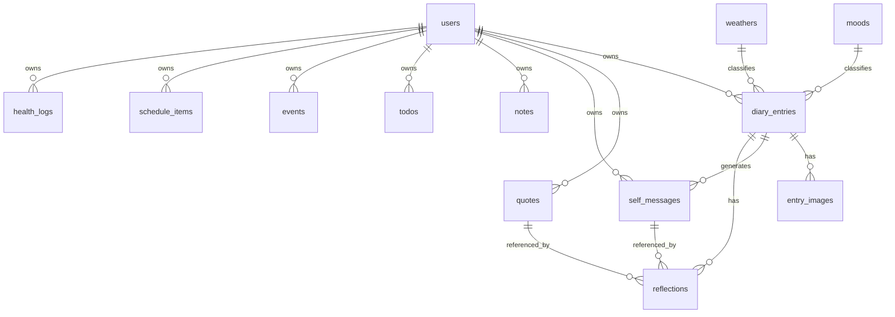

# 03 — Thiết kế Database (PostgreSQL)

## 1. Quy ước chung

- Engine: PostgreSQL (Neon serverless).
- Kiểu dữ liệu: `uuid` cho khóa chính (hoặc `bigserial`), `timestamptz` cho thời gian, `date` cho ngày.
- **Mọi bảng nghiệp vụ có `user_id`** → cách ly dữ liệu theo tài khoản.
- Ràng buộc duy nhất quan trọng: `diary_entries(user_id, entry_date)`, `health_logs(user_id, log_date)`.
- Xóa mềm với `is_active`/`deleted_at` cho các bảng cần giữ dữ liệu (quotes, entries).

## 2. ERD (Mermaid)

## 3. Bảng `users`

| Cột | Kiểu | Ràng buộc | Mô tả |
|---|---|---|---|
| id | uuid | PK, default gen_random_uuid() | Định danh user |
| email | varchar(255) | UNIQUE, NOT NULL | Email đăng nhập |
| username | varchar(50) | UNIQUE, NOT NULL | Tên hiển thị/đăng nhập |
| password_hash | varchar(255) | NOT NULL | Hash bcrypt |
| display_name | varchar(100) | NULL | Tên hiển thị |
| is_active | boolean | NOT NULL default true | Kích hoạt tài khoản |
| created_at | timestamptz | NOT NULL default now() | |
| updated_at | timestamptz | NOT NULL default now() | |

## 4. Bảng tra cứu `moods`

| Cột | Kiểu | Ràng buộc | Mô tả |
|---|---|---|---|
| id | smallint | PK | |
| code | varchar(20) | UNIQUE, NOT NULL | vd: happy |
| label_vi | varchar(50) | NOT NULL | vd: Vui |
| color_hex | char(7) | NOT NULL | vd: #FFD93D |
| icon | varchar(20) | NOT NULL | emoji/icon name |
| sort_order | smallint | NOT NULL default 0 | |

**Seed 5 cảm xúc**

| code | label_vi | icon | color_hex |
|---|---|---|---|
| happy | Vui | 😀 | #FFD93D |
| sad | Buồn | 😢 | #4A90D9 |
| bored | Chán | 😑 | #9E9E9E |
| normal | Bình thường | 😐 | #A8D5BA |
| angry | Giận | 😠 | #E74C3C |

## 5. Bảng tra cứu `weathers`

| Cột | Kiểu | Ràng buộc | Mô tả |
|---|---|---|---|
| id | smallint | PK | |
| code | varchar(20) | UNIQUE, NOT NULL | vd: sunny |
| label_vi | varchar(50) | NOT NULL | vd: Nắng |
| color_hex | char(7) | NOT NULL | |
| icon | varchar(20) | NOT NULL | |
| sort_order | smallint | NOT NULL default 0 | |

**Seed 5 thời tiết**

| code | label_vi | icon | color_hex |
|---|---|---|---|
| sunny | Nắng | ☀️ | #FFB300 |
| overcast | Râm | ⛅ | #90A4AE |
| rain | Mưa | 🌧️ | #5C9EDB |
| storm | Bão | ⛈️ | #37474F |
| other | Khác | ❔ | #78909C |

## 6. Bảng `diary_entries` (trung tâm)

| Cột | Kiểu | Ràng buộc | Mô tả |
|---|---|---|---|
| id | uuid | PK | |
| user_id | uuid | FK→users(id), NOT NULL | Chủ sở hữu |
| entry_date | date | NOT NULL | Ngày của nhật ký |
| mood_id | smallint | FK→moods(id), NULL | Cảm xúc |
| weather_id | smallint | FK→weathers(id), NULL | Thời tiết |
| diary_text | text | NULL | Nội dung nhật ký |
| other_perspective | text | NULL | 1 câu quan điểm từ góc nhìn khác |
| future_message | text | NULL | 1 câu nhắn nhủ tương lai (hoặc câu hỏi) |
| self_care | text | NULL | Hôm nay tự chăm sóc bản thân thế nào |
| tomorrow_hope | text | NULL | Hi vọng cho ngày mai |
| gratitude | text | NULL | Lòng biết ơn |
| dream | text | NULL | Giấc mơ đã trải qua |
| created_at | timestamptz | NOT NULL default now() | |
| updated_at | timestamptz | NOT NULL default now() | |

**Ràng buộc**: `UNIQUE (user_id, entry_date)`.

## 7. Bảng `entry_images`

| Cột | Kiểu | Ràng buộc | Mô tả |
|---|---|---|---|
| id | uuid | PK | |
| entry_id | uuid | FK→diary_entries(id) ON DELETE CASCADE | Thuộc entry nào |
| object_key | varchar(512) | NOT NULL | Khóa trên Neon Object Storage, vd `entries/{entry_id}/{uuid}.jpg` |
| url | varchar(1024) | NULL | URL công khai/presigned (nếu có) |
| content_type | varchar(100) | NOT NULL | vd image/jpeg |
| size_bytes | bigint | NULL | Kích thước |
| width | int | NULL | Chiều rộng ảnh |
| height | int | NULL | Chiều cao ảnh |
| caption | varchar(255) | NULL | Chú thích ảnh |
| created_at | timestamptz | NOT NULL default now() | |

**Index**: `idx_entry_images_entry (entry_id)`.

## 8. Bảng `quotes` (kho câu — CRUD)

| Cột | Kiểu | Ràng buộc | Mô tả |
|---|---|---|---|
| id | uuid | PK | |
| user_id | uuid | FK→users(id), NULL | NULL = câu hệ thống/seed; có giá trị = câu user thêm |
| text | text | NOT NULL | Nội dung câu |
| author | varchar(150) | NULL | Tác giả |
| source | varchar(150) | NULL | Nguồn (Facebook, TikTok, sách...) |
| category | varchar(50) | NULL | động viên / giáo dục / ... |
| is_active | boolean | NOT NULL default true | Bật/tắt khỏi vòng random |
| created_at | timestamptz | NOT NULL default now() | |
| updated_at | timestamptz | NOT NULL default now() | |

**Index**: `idx_quotes_category (category)`, `idx_quotes_active (is_active)`.

## 9. Bảng `self_messages` (lời nhắn nhủ của bản thân)

| Cột | Kiểu | Ràng buộc | Mô tả |
|---|---|---|---|
| id | uuid | PK | |
| user_id | uuid | FK→users(id), NOT NULL | |
| entry_id | uuid | FK→diary_entries(id) ON DELETE SET NULL, NULL | Sinh ra từ entry nào (nếu có) |
| content | text | NOT NULL | Nội dung lời nhắn |
| created_at | timestamptz | NOT NULL default now() | |

## 10. Bảng `reflections` (suy nghĩ về 2 câu)

| Cột | Kiểu | Ràng buộc | Mô tả |
|---|---|---|---|
| id | uuid | PK | |
| user_id | uuid | FK→users(id), NOT NULL | |
| entry_id | uuid | FK→diary_entries(id) ON DELETE CASCADE | Gắn với entry ngày đó |
| quote_id | uuid | FK→quotes(id) ON DELETE SET NULL, NULL | Câu kho được hiển thị |
| self_message_id | uuid | FK→self_messages(id) ON DELETE SET NULL, NULL | Câu của bản thân được hiển thị |
| thought | text | NULL | Suy nghĩ của bạn về 2 câu |
| created_at | timestamptz | NOT NULL default now() | |

## 11. Bảng `notes` (ghi chú nhanh)

| Cột | Kiểu | Ràng buộc | Mô tả |
|---|---|---|---|
| id | uuid | PK | |
| user_id | uuid | FK→users(id), NOT NULL | |
| content | text | NOT NULL | Nội dung ghi chú nhanh |
| color | char(7) | NULL | Màu nhãn (tùy chọn) |
| is_pinned | boolean | NOT NULL default false | Ghim lên đầu |
| created_at | timestamptz | NOT NULL default now() | |
| updated_at | timestamptz | NOT NULL default now() | |

## 12. Bảng `todos` (mục tiêu tuần / công việc)

| Cột | Kiểu | Ràng buộc | Mô tả |
|---|---|---|---|
| id | uuid | PK | |
| user_id | uuid | FK→users(id), NOT NULL | |
| title | varchar(255) | NOT NULL | Tiêu đề |
| notes | text | NULL | Mô tả |
| due_date | date | NULL | Hạn |
| week_label | varchar(20) | NULL | vd `2026-W15` để gom theo tuần |
| priority | smallint | NOT NULL default 2 | 1=cao, 2=vừa, 3=thấp |
| is_done | boolean | NOT NULL default false | Hoàn thành |
| completed_at | timestamptz | NULL | |
| created_at | timestamptz | NOT NULL default now() | |

**Index**: `idx_todos_user_week (user_id, week_label)`.

## 13. Bảng `events` (sự kiện đặc biệt)

| Cột | Kiểu | Ràng buộc | Mô tả |
|---|---|---|---|
| id | uuid | PK | |
| user_id | uuid | FK→users(id), NOT NULL | |
| title | varchar(255) | NOT NULL | Tiêu đề sự kiện |
| description | text | NULL | Mô tả |
| start_at | timestamptz | NOT NULL | Bắt đầu |
| end_at | timestamptz | NULL | Kết thúc |
| location | varchar(255) | NULL | Địa điểm |
| is_all_day | boolean | NOT NULL default false | Cả ngày |
| created_at | timestamptz | NOT NULL default now() | |

**Index**: `idx_events_user_start (user_id, start_at)`.

## 14. Bảng `schedule_items` (lịch biểu)

| Cột | Kiểu | Ràng buộc | Mô tả |
|---|---|---|---|
| id | uuid | PK | |
| user_id | uuid | FK→users(id), NOT NULL | |
| title | varchar(255) | NOT NULL | |
| start_at | timestamptz | NOT NULL | |
| end_at | timestamptz | NULL | |
| recurrence_rule | varchar(255) | NULL | Lặp: `daily`, `weekly:MON`, `RRULE` rút gọn |
| reminder_minutes | int | NULL | Nhắc trước bao nhiêu phút |
| created_at | timestamptz | NOT NULL default now() | |

## 15. Bảng `health_logs` (sức khỏe)

| Cột | Kiểu | Ràng buộc | Mô tả |
|---|---|---|---|
| id | uuid | PK | |
| user_id | uuid | FK→users(id), NOT NULL | |
| log_date | date | NOT NULL | Ngày ghi nhận |
| steps | int | NULL | Số bước chân |
| workout_minutes | int | NULL | Thời gian tập luyện (phút) |
| water_ml | int | NULL | Nước uống (tùy chọn) |
| sleep_hours | numeric(4,2) | NULL | Giấc ngủ (tùy chọn) |
| weight_kg | numeric(5,2) | NULL | Cân nặng (tùy chọn) |
| note | text | NULL | Ghi chú sức khỏe |
| created_at | timestamptz | NOT NULL default now() | |

**Ràng buộc**: `UNIQUE (user_id, log_date)`.

## 16. Tổng hợp index

| Bảng | Index |
|---|---|
| diary_entries | `uq_entries_user_date (user_id, entry_date)`, `idx_entries_month (user_id, entry_date)` |
| entry_images | `idx_entry_images_entry (entry_id)` |
| quotes | `idx_quotes_category`, `idx_quotes_active` |
| self_messages | `idx_selfmsg_user (user_id)` |
| reflections | `idx_reflections_entry (entry_id)` |
| notes | `idx_notes_user (user_id, created_at DESC)` |
| todos | `idx_todos_user_week (user_id, week_label)` |
| events | `idx_events_user_start (user_id, start_at)` |
| schedule_items | `idx_sched_user_start (user_id, start_at)` |
| health_logs | `uq_health_user_date (user_id, log_date)` |

## 17. Ghi chú kỹ thuật

- `gen_random_uuid()` cần extension `pgcrypto` (Neon hỗ trợ sẵn).
- `updated_at` cập nhật qua trigger hoặc ở tầng ORM (SQLAlchemy `onupdate=func.now()`).
- Xóa user (nếu có) → cascade tới dữ liệu con theo thiết kế FK.

