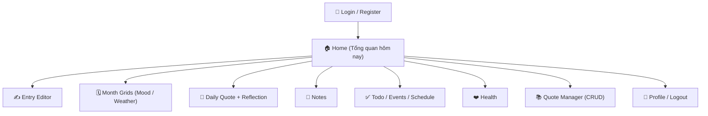

# 07 — Thiết kế UI (Wireframe & Design System)

## 1. Design System

- **Style**: Material 3, bo góc mềm, màu chủ đạo xanh lam dịu.
- **Font**: Roboto (mặc định) / Inter.
- **Bố cục**: responsive — 1 cột trên điện thoại, 2 cột trên web/desktop.
- **Thành phần tái sử dụng**: `AppBar` có nút điều hướng tháng, `IconPickerRow`, `MonthGrid`, `QuoteCard`, `SectionCard`.

## 2. Bảng màu Mood

| Cảm xúc | Icon | Màu |
|---|---|---|
| Vui | 😀 | `#FFD93D` |
| Buồn | 😢 | `#4A90D9` |
| Chán | 😑 | `#9E9E9E` |
| Bình thường | 😐 | `#A8D5BA` |
| Giận | 😠 | `#E74C3C` |

## 3. Bảng màu Weather

| Thời tiết | Icon | Màu |
|---|---|---|
| Nắng | ☀️ | `#FFB300` |
| Râm | ⛅ | `#90A4AE` |
| Mưa | 🌧️ | `#5C9EDB` |
| Bão | ⛈️ | `#37474F` |
| Khác | ❔ | `#78909C` |
| (Không có dữ liệu) | — | `#EEEEEE` |

## 4. Danh sách màn hình



## 5. Wireframe các màn hình chính

### 5.1. Home (Tổng quan hôm nay)
```
┌───────────────────────────────┐
│ ☰ Memoir        📅 04/04  👤  │
├───────────────────────────────┤
│ THỜI TIẾT      CẢM XÚC            │  ← IconPickerStrip: 1 hàng khi rộng
│ ☀️⛅🌧️⛈️❔   😀😢😑😐😠           │    (2 hàng khi hẹp)
├───────────────────────────────┤
│ 💬 Câu hôm nay                │
│  • "..." (từ kho)             │
│  • "..." (của bạn)            │
│  ┌─────────────────────────┐  │
│  │ Suy nghĩ của bạn...     │  │  ← reflection input
│  └─────────────────────────┘  │
├───────────────────────────────┤
│ ✍️ Viết nhật ký →             │
│ 🌱 Tự chăm sóc  🌅 Hi vọng    │
│ 🙏 Biết ơn      💭 Giấc mơ    │
└───────────────────────────────┘
```

### 5.2. Entry Editor
```
┌───────────────────────────────┐
│ ←  Nhật ký 04/04/2026    💾   │
├───────────────────────────────┤
│ Thời tiết: ☀️ ⛅ 🌧️ ⛈️ ❔     │
│ Cảm xúc:   😀 😢 😑 😐 😠     │
├───────────────────────────────┤
│ 📝 Nhật ký                    │
│ ┌───────────────────────────┐ │
│ │ Nội dung...               │ │
│ └───────────────────────────┘ │
│ 🖼️ Ảnh:  [+] (upload)        │
├───────────────────────────────┤
│ 🧭 Góc nhìn khác:  [______]   │
│ 🔮 Nhắn nhủ tương lai: [____] │
│ 🌱 Tự chăm sóc:    [______]   │
│ 🌅 Hi vọng ngày mai:[______]  │
│ 🙏 Biết ơn:        [______]   │
│ 💭 Giấc mơ:        [______]   │
└───────────────────────────────┘
```

### 5.3. Month Grids
```
┌───────────────────────────────┐
│ ←  Tháng 4/2026          ‹ ›  │
├───────────────────────────────┤
│ CẢM XÚC                       │
│ T2 T3 T4 T5 T6 T7 CN          │
│ ▪▪ ▪▪ ▪▪ ▪▪ ▪▪ ▪▪ ▪▪          │  ← ô đổ màu mood
│ ▪▪ ▪▪ ▪▪ ▪▪ ▪▪ ▪▪ ▪▪          │
│ ...                           │
│ Chú giải: 😀😢😑😐😠           │
├───────────────────────────────┤
│ THỜI TIẾT                     │
│ (lưới tương tự, màu weather)  │
└───────────────────────────────┘
```

### 5.4. Quote Manager (CRUD)
```
┌───────────────────────────────┐
│ ←  Kho câu            [+ Thêm]│
├───────────────────────────────┤
│ [Tìm kiếm]   [Loại ▾]         │
│ • "..."  — Tác giả  ✏️ 🗑️    │
│ • "..."  — Tác giả  ✏️ 🗑️    │
│ ... (phân trang)              │
└───────────────────────────────┘
```

## 6. Hành vi tương tác

| Thành phần | Hành vi |
|---|---|
| IconPickerRow | Tap 1 icon → chọn, viền highlight; tap lại icon khác → đổi |
| IconPickerStrip | 10 icon (5 thời tiết + 5 cảm xúc) trên **1 hàng** khi ≥44dp mỗi ô; tự xuống 2 hàng khi cửa sổ hẹp |
| MonthGrid cell | Màu theo mood/weather; tap → mở Entry Editor của ngày đó |
| Quote card | Nút 🔄 để lấy cặp câu khác trong ngày (tùy chọn) |
| Entry Editor | Autosave khi rời màn hình hoặc bấm 💾 |
| Todo item | Tick → `PATCH /todos/{id}/done` |

## 7. Khả năng truy cập (accessibility)

- Kích thước nút icon ≥ 44×44dp.
- Chú thích màu kèm **nhãn chữ** (không chỉ dựa vào màu).
- Hỗ trợ dark mode (Material 3 ColorScheme.fromSeed).
