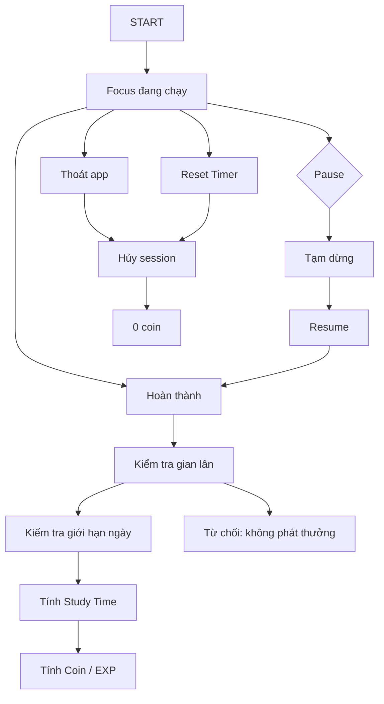

# 09 — Khu vườn học tập (Focus Garden)

> **Trạng thái: ĐẶC TẢ — CHƯA TRIỂN KHAI.**
> Tài liệu này mô tả tính năng sẽ làm ở [Phase 8–13](../PLAN.md). Ở thời điểm hiện tại **chưa có** bảng, endpoint hay màn hình nào của Focus Garden trong mã nguồn; mọi API/DB dưới đây là **thiết kế dự kiến**.

Tài liệu đặc tả: vòng tập trung (timer) → thời gian học thật → coin/EXP → gieo hạt đậu nảy mầm → mua nước/phân bón → bảng xếp hạng và sự kiện.

---

## 1. Mục tiêu

Biến "ngồi học" thành một vòng lặp có phần thưởng rõ ràng:

1. **Tập trung** bằng timer, có xác minh thời gian thật (chống gian lân).
2. **Tích lũy** Study Time → đổi thành **Coin** và **EXP**.
3. **Gieo hạt đậu**; mỗi phút học được cộng growth → cây nảy mầm rồi ra hoa.
4. **Dùng Coin** mua nước, phân bón, hạt giống.
5. **Đua hạng** qua bảng xếp hạng và các sự kiện do admin tổ chức.

---

## 2. Luồng chính

Bám sát flow đã thống nhất:

Đặc điểm quan trọng:

| Hành động | API | Kết quả |
|---|---|---|
| START | `POST /focus/sessions` | Tạo phiên, `status=running`, server trả `heartbeat_interval_seconds` |
| Pause → Tạm dừng | `POST /focus/sessions/{id}/pause` | Đồng hồ dừng, `paused_seconds` tích lũy |
| Resume | `POST /focus/sessions/{id}/resume` | Chạy tiếp, không tính vào thời gian đã pause |
| Thoát app | (không gọi API) | Phiên mồ côi, không được tính |
| Reset Timer → Hủy | `POST /focus/sessions/{id}/cancel` | `status=cancelled`, **0 coin** |
| Hoàn thành | `POST /focus/sessions/{id}/complete` | Chạy 4 bước kiểm tra → trả settlement |

---

## 3. Cơ chế chống gian lân

**Nguyên tắc: server đo thời gian, không bao giờ tin số liệu client gửi lên.** Vì vậy timer **bắt buộc phải có mạng** trong suốt phiên.

1. **Đồng hồ server**: `elapsed = now - started_at - paused_seconds`. Client không thể chỉnh số này.
2. **Heartbeat bắt buộc**: client ping `POST /focus/sessions/{id}/heartbeat` mỗi 30s.
   Nếu `now - last_heartbeat_at > 90s` → `stall_count += 1` và **đoạn thời gian đó không được tính**.
3. **Đối chiếu hai chiều**: client gửi kèm `client_elapsed_seconds`; nếu
   `|server_elapsed - client_elapsed| > 30s` → gắn cờ `desync`.
4. **Chặn gieo coin tức thì**: phiên hoàn thành với `elapsed < 60s` → `rejected`, không phát thưởng.
5. **Giới hạn ngày**: `credited_hôm_nay + phút_phiên_này ≤ 480` → cắt bớt, trả `capped: true`.
6. **Ngưỡng điều tra**: `stall_count >= 3` → từ chối phiên, không phát thưởng.

Kết quả trả về cho client (trường `status` của settlement):

- `completed` — tính thưởng đầy đủ
- `capped` — tính thưởng nhưng đã bị chặm trần ngày
- `rejected` — không tính (gian lân hoặc quá ngắn)

---

## 4. Kinh tế game

### 4.1 Tỉ lệ quy đổi

| Đại lượng | Công thức |
|---|---|
| Coin | `floor(credited_minutes / 5)` |
| EXP | `credited_minutes` |
| Cấp | `level = 1 + total_exp // 300` |

> `credited_minutes` là phút **đã qua kiểm tra**, không phải phút client khai.

### 4.2 Vật phẩm (seed vào `shop_items`)

| Mã | Tên | Giá | Tác dụng |
|---|---|---|---|
| `water` | Tưới nước | 5 coin | Tăng `water_level` cây đang lớn |
| `fertilizer` | Phân bón | 10 coin | Cộng nhanh growth cho cây |
| `bean_seed` | Hạt đậu | 3 coin | Gieo 1 cây mới |

### 4.3 Cây đậu nảy mầm

Mỗi phiên hoàn thành tự động tưới và cộng `credited_minutes` vào cây đang lớn:

| Stage | Ngưỡng growth tích lũy |
|---|---|
| `seed` (hạt) | 0 |
| `sprout` (nảy mầm) | 30 |
| `young` (cây non) | 90 |
| `mature` (cây lớn) | 180 |
| `bloom` (nở hoa) | 300 |

Đạt `bloom` thì **thu hoạch** được (thưởng EXP), cây được đánh dấu `harvested_at`.

---

## 5. Thiết kế dữ liệu (7 bảng — chưa tạo)

| Bảng | Vai trò | Cột chính |
|---|---|---|
| `garden_profiles` | 1-1 với user | `coins, exp, level, total_study_minutes, streak_days, last_study_date` |
| `focus_sessions` | 1 phiên tập trung | `status, planned_minutes, elapsed_seconds, credited_minutes, coins_earned, exp_earned, heartbeat_count, stall_count, last_heartbeat_at` |
| `garden_plots` | Cây/hạt đậu | `seed_code, stage, growth, water_level, fertilizer_level, harvested_at` |
| `shop_items` | Catalog vật phẩm hệ thống | `code, name_vi, price_coins, effect, is_active` (`user_id NULL` — giống pattern `quotes`) |
| `user_inventory` | Số lượng vật phẩm | `item_code, quantity` — unique `(user_id, item_code)` |
| `garden_challenges` | Sự kiện do admin tạo | `title, metric, target, reward_coins, reward_exp, starts_at, ends_at, is_active` |
| `garden_challenge_progress` | Tiến độ từng user | `progress, claimed_at` — unique `(challenge_id, user_id)` |

Chi tiết cột/khóa: [03-database-schema.md](03-database-schema.md).

---

## 6. API dự kiến

### 6.1 Tập trung — `/focus`

| Method | Path | Mô tả |
|---|---|---|
| POST | `/focus/sessions` | Mở phiên mới (kèm `planned_minutes`) |
| GET | `/focus/sessions/active` | Khôi phục phiên đang chạy (app bị tắt) |
| POST | `/focus/sessions/{id}/heartbeat` | Ping giữ phiên sống |
| POST | `/focus/sessions/{id}/pause` | Tạm dừng |
| POST | `/focus/sessions/{id}/resume` | Tiếp tục |
| POST | `/focus/sessions/{id}/complete` | Hoàn thành → trả settlement |
| POST | `/focus/sessions/{id}/cancel` | Hủy (0 coin) |
| GET | `/focus/sessions?from=&to=` | Lịch sử phiên |

### 6.2 Khu vườn — `/garden`

| Method | Path | Mô tả |
|---|---|---|
| GET | `/garden/profile` | Ví: coin, exp, level, streak |
| GET | `/garden/plots` | Danh sách cây |
| POST | `/garden/plots` | Gieo hạt (`seed_code`) |
| POST | `/garden/plots/{id}/water` | Dùng 1 nước |
| POST | `/garden/plots/{id}/fertilize` | Dùng 1 phân bón |
| POST | `/garden/plots/{id}/harvest` | Thu hoạch (chỉ khi `bloom`) |
| GET | `/garden/shop` | Danh mục vật phẩm |
| GET | `/garden/inventory` | Vật phẩm đang có |
| POST | `/garden/purchase` | Mua `{item_code, quantity}` |
| GET | `/garden/leaderboard?period=day\|week\|all` | Xếp hạng + hạng của chính mình |
| GET | `/garden/challenges` | Sự kiện đang chạy + tiến độ của tôi |
| POST | `/garden/challenges/{id}/claim` | Nhận thưởng khi đủ điều kiện |

### 6.3 Admin — `/admin/garden` (dùng `require_admin`)

| Method | Path | Mô tả |
|---|---|---|
| GET/POST | `/admin/garden/challenges` | Danh sách / tạo sự kiện |
| PUT/DELETE | `/admin/garden/challenges/{id}` | Sửa / xoá sự kiện |

---

## 7. Màn hình Flutter

| Màn hình | Nội dung |
|---|---|
| `garden_screen.dart` | Hub: coin/EXP/level/streak, cây đang lớn, lối vào timer |
| `focus_timer_screen.dart` | Đồng hồ đếm ngược, Pause/Resume/Reset/Complete, chỉ báo heartbeat |
| `leaderboard_screen.dart` | Bảng xếp hạng theo ngày/tuần/tất cả |
| `garden_shop_screen.dart` | Mua nước / phân bón / hạt |
| `garden_events_screen.dart` | Sự kiện + tiến độ + nhận thưởng |
| `plant_view.dart` | Vẽ cây theo `stage` bằng `CustomPainter` |

State: `FocusTimerNotifier` (Riverpod `StateNotifier`) + `Timer.periodic` cho heartbeat,
kèm `WidgetsBindingObserver` để phát hiện app bị đẩy nền.

---

## 8. Giả định

1. **Coin là tiền ảo trong game**, không rút ra ngoài, không quy đổi tiền thật.
2. **Bảng xếp hạng toàn cục** giữa các tài khoản; chỉ hiện `username`, không lộ email/nội dung nhật ký.
3. **Timer cần mạng**. Mất mạng → UI cảnh báo và **tự pause**, tránh đếm rồi mất thưởng.
4. **Cây vẽ bằng `CustomPainter`/emoji**, không cần file ảnh.
5. **Sự kiện do admin tạo** qua API admin; tiến độ user cập nhật tự động theo hoạt động thật.

## 9. Chia phase (theo [PLAN.md](../PLAN.md))

| Phase | Nội dung |
|---|---|
| 8 | Backend models + migration + `focus_service` + router `/focus` + test |
| 9 | Chống gian lân + cộng Coin/EXP |
| 10 | Vườn, shop, vật phẩm |
| 11 | Bảng xếp hạng + sự kiện (admin tạo) |
| 12 | Flutter: timer + hub vườn |
| 13 | Flutter: shop, leaderboard, sự kiện |

---

[← Quay lại danh mục tài liệu](../README.md#5-tài-liệu)
   `|server_elapsed - client_elapsed| > 30s` → gắn cờ `desync`.
4. **Chặn gieo coin tức thì**: phiên hoàn thành với `elapsed < 60s` → `rejected`, không phát thưởng.
5. **Giới hạn ngày**: `credited_hôm_nay + phút_phiên_này ≤ 480` → cắt bớt, trả `capped: true`.
6. **Ngưỡng điều tra**: `stall_count >= 3` → từ chối phiên, không phát thưởng.

Kết quả trả về cho client (trường `status` của settlement):

- `completed` — tính thưởng đầy đủ
- `capped` — tính thưởng nhưng đã bị chặm trần ngày
- `rejected` — không tính (gian lân hoặc quá ngắn)